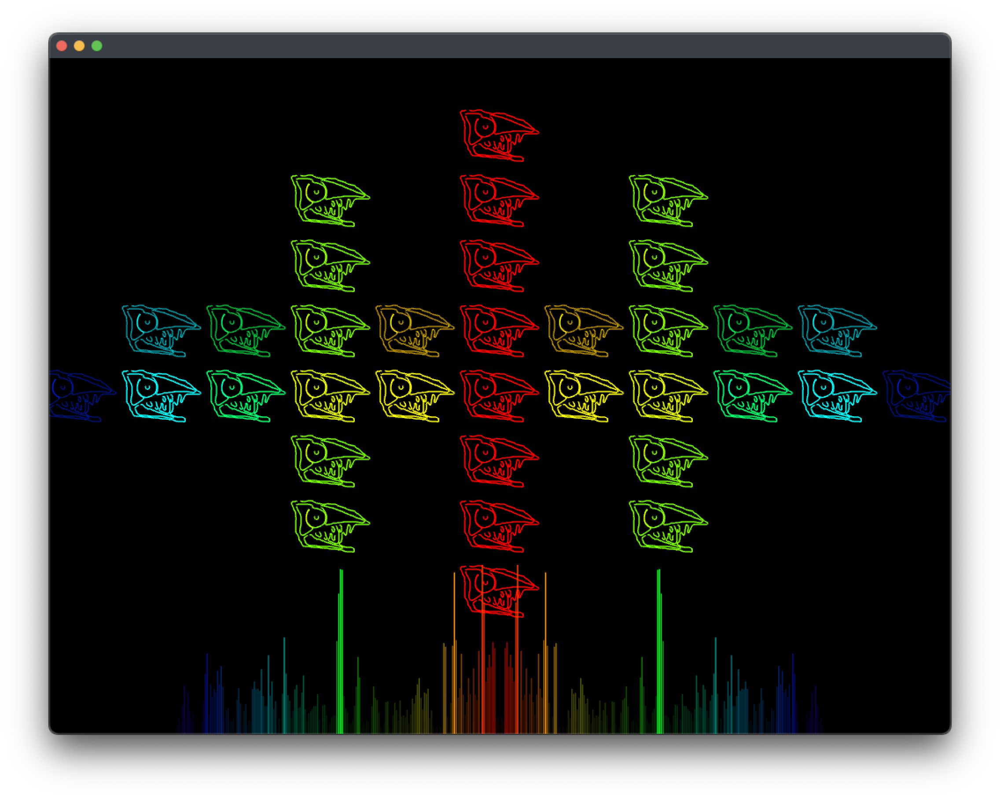

# Realtime Customised Audio Visual Generator

This project generates CG visual from sound input from the microphone.

The project reads in a given png/jpg file (default is given, storing under `/bin/data`) and generates discrete wave-like sound-reaction animation by using the given image as a stamp.

By changing the image in the `data` folder manually, the user can customise what to be the stamp and enjoy the visual effect.

At the bottom, the wave form shows a higher sample rate, which is actually the raw FFT extracted before processed into the img version. This servers as a reference for the relatively true wave form.

## Demo
The following is a screenshot whilel the app is running.

Please also check the demo video `demo.mmov` to see how it acutally reacts real-time from the microphone input.
## Usage

For Xcode, open the project, and press `commmand`+`R` or click on the Run buttom on the left up corner.

For VS Code, try `command`+`shift`+`P` > **build and run task** first.
If error occurs or the option is not found, run `make` in the termminal directly and then `make RunRelease` to execute the program. 

Note that the program may ask for permission to asscess the `bin/data` file and the access to the microphone.
## Input changable from the user
- An image
  - This will be used to generate the stamp.
  - The input filename is hardcoded in `setup()` in `ofApp.cpp`, can be changed to other filenames. accroding to the user's image.
  - Add your image in `bin/data` , and change the image file name in line `img.load("tab.png");` (`ofApp.cpp`) to yours!
  - The image is expected to have white background with clear blacklines on it, since the program will extract its lines and store it into polyline vector form for the drawing loop.
Please 
- Make some noise or play some music in front of microphone!
  - If the waveform is dead, please check if the microphone is on, and is not blocking the application.

## Parameter adjustable from developer
- FFT Sample rate
  - Change the `512` in `fft.setup(512)` in the `setup()` of `ofApp.cpp` to another `pow(2.0,n)`, where larger `n` will result in higher sample rate.
  - The discrete image display may show slightly different after changing this value. It tooks FFT value from the rangeMax of the `fft.bufffer()` for the visual amplitude.

## Addons
- openframeworks built-in addons
  - `ofxOpenCV`
- addons by Kyle Mcdonald
  - `ofxCv`: for simpler img preprocessing for line extraction.
  - `ofxFft`: for capturing and processing the sound into FFT buffer.
